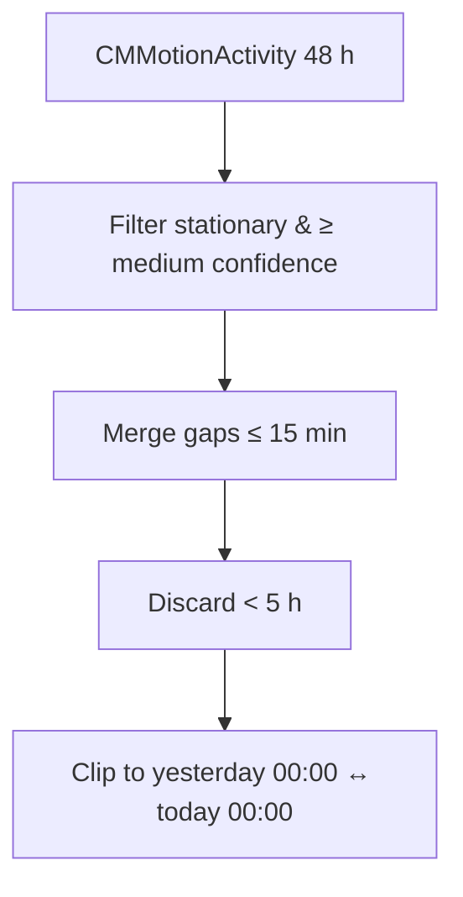

# Optimum – Comprehensive Guide

*A sleep assistant*

---

## Key Features

| Domain                          | What Optimum Delivers                                                                                                                                                                                   |
| ------------------------------- | ------------------------------------------------------------------------------------------------------------------------------------------------------------------------------------------------------- |
| **Motion-only Sleep Detection** | Analyses the last **48 h** of `CMMotionActivity` samples, merges gaps ≤ 15 min, then keeps stationary stretches **≥ 5 h** as sleep segments. Works fully offline and on devices without an Apple Watch. |
| **Optional HealthKit Fusion**   | • Reads **Step Count** each morning to feed the quality model.<br>• Can **write** detected segments as *Sleep Analysis* so the Health app shows them alongside watch data.                              |
| **Rule-Based Quality Model**    | Considers duration vs goal, fragmentation, bedtime regularity, and daily steps. User manual rating overrides the algorithm and persists.                                                                |
| **Data Visualisation**          | Swift Charts show Bedtimes, Hours, Stars & Steps for the last 7 nights, automatically coloured by your accent tint.                                                                                     |
| **Behavioural Cues**            | Local notifications for caffeine cut-off (−6 h) & wind-down / melatonin (−1 h) relative to your target bedtime.                                                                                         |
| **Glassmorphic UI**             | Frosted cards over a starry NightSky background, adaptive to light & dark mode.                                                                                                                         |
| **Theming**                     | Real-time colour picker: changes accent colour across tiles, charts and icons; persisted with `@AppStorage`.                                                                                            |
| **Zero External Services**      | No ad-SDKs, analytics or network calls – all data is on-device.                                                                                                                                         |

---

## 🛠  Environment

* **Xcode 15**
* **Swift 5.9**
* **Deployment Target:** iOS 17.0
* **Device:** real iPhone / iPod touch (Core Motion isn’t available in the simulator)

---

## 🚀 Quick-start

```bash
# clone & open
$ git clone https://github.com/your-username/optimum.git
$ cd optimum
$ open Optimum.xcodeproj
```

Build & run on a connected device. First launch shows the splash and then requests:

1. **Motion & Fitness** → to read motion samples.
2. **Health** (optional) → Sleep Analysis (read/write) and Step Count (read).
3. **Notifications** → to fire bedtime cues.

---

## Xcode Project Setup

### 1 – Signing & Capabilities

| Capability                              | Purpose                                                                                                |
| --------------------------------------- | ------------------------------------------------------------------------------------------------------ |
| **HealthKit**                           | Read `HKQuantityTypeIdentifierStepCount` and optionally write `HKCategoryTypeIdentifierSleepAnalysis`. |
| *(Optional)* Critical Alerts            | Only needed if you change the alarm sound to `.defaultCritical`.                                       |
| **Background Modes ▸ Background Fetch** | Allows Optimum to auto-refresh soon after midnight even if not opened.                                 |

### 2 – Info.plist privacy keys

| Key                              | Value                                                     |
| -------------------------------- | --------------------------------------------------------- |
| `NSMotionUsageDescription`       | “Optimum uses motion data to estimate your sleep.”        |
| `NSHealthShareUsageDescription`  | “Optimum reads your steps and sleep history.”             |
| `NSHealthUpdateUsageDescription` | “Optimum saves detected sleep blocks to your Health app.” |

### 3 – Entitlements

`optimum.entitlements` should contain (generated by Xcode when you add the capability):

```xml
<key>com.apple.developer.healthkit</key>
<dict>
  <key>HKReadTypes</key>
  <array>
    <string>HKCategoryTypeIdentifierSleepAnalysis</string>
    <string>HKQuantityTypeIdentifierStepCount</string>
  </array>
  <key>HKWriteTypes</key>
  <array>
    <string>HKCategoryTypeIdentifierSleepAnalysis</string>
  </array>
</dict>
```

---

## 📂 Directory Walkthrough

```
Optimum/
├─ OptimumApp.swift        # @main, env objects, splash toggle
├─ SplashView.swift        # Star-field launch screen (2 s fade)
│
├─ HomeView.swift          # Dashboard tiles (Hours, Quality, etc.)
├─ TrendsView.swift        # 7-day Swift Charts + suggestions
├─ QualityDetailView.swift # Rate stars, alarm picker, caffeine advice
├─ BedtimeDetailView.swift # List of segment start times for yesterday
│
├─ ThemeManager.swift      # Accent RGB in @AppStorage
│
├─ Data layer
│  ├─ SleepEntry.swift         # Codable nightly record (hours, bedtimes…)
│  ├─ MotionSleepDetector.swift# 5 h stationary-block algorithm
│  ├─ SleepAnalyzer.swift      # Rule scorer → 1-5 stars
│  ├─ SleepManager.swift       # Queries Core Motion, publishes last night
│  ├─ SleepStore.swift         # 7-day ring buffer, JSON, step fetch & quality
│  ├─ HealthKitManager.swift   # Tiny wrapper (steps + save sleep)
│  └─ NotificationManager.swift# Bedtime cues + daily alarm
│
└─ Assets.xcassets/
   └─ NightSky [single-scale PNG]  # background for all screens
```

---

## 🤖 Algorithm Deep-dive

### MotionSleepDetector (phone-only)



* **Stationary w/ confidence**: phone isn’t moved → likely in bed.
* **Merging** handles brief roll-overs.
* **≥ 5 h** threshold ignores naps/sofa sessions.
* Outputs array of `(start, end)` pairs.

### SleepAnalyzer (transparent rules)

| Factor                             | Deduction          |
| ---------------------------------- | ------------------ |
| < 80 % of goal                     | −2 stars           |
| 80–100 % of goal                   | −1                 |
| Each extra segment (first is free) | −1 each (up to −2) |
| Avg bedtime deviation > 1 h        | −1                 |
| > 1 h off target bedtime           | −1                 |
| < 3 000 steps                      | −1                 |

Score is clamped **1…5**. Manual edits override future recalcs for that night.

---

## 🧮 Sleep-debt formula

```swift
totalDebt = week.reduce(0) { sum, entry in
    let deficit = goalHours - entry.hours
    return deficit > 0 ? sum + deficit : sum
}
```

*`goalHours` = duration from target bedtime ➔ alarm.*

Displayed debt is the **sum of shortfalls** over the past 7 nights. (0.0 h if you met or exceeded goal every night.)

---

## 🎨 Customising the UI

| Want to…                     | Change                                                              | File               |
| ---------------------------- | ------------------------------------------------------------------- | ------------------ |
| Use a different background   | Replace **NightSky** asset (single-scale)                           | Assets.xcassets    |
| Adjust card opacity / radius | `tile()` helper                                                     | `HomeView.swift`   |
| Swap fonts                   | Replace `ChalkboardSE` with any bundled TTF, register in Info.plist | all views          |
| Shorten/extend the splash    | `try? await Task.sleep(...)`                                        | `SplashView.swift` |

---

## 🗃  Persistence & Privacy

* **Week buffer** is JSON-encoded to *Documents/sleep.json* – sandboxed, not backed-up to iCloud.
* HealthKit reads/writes stay on-device and respect the user’s HK privacy settings.
* No network code → Optimum never uploads data.

---

## 🚦 Roadmap

* Apple Watch heart-rate / HRV fusion for finer sleep detection.
* WidgetKit home-screen & StandBy widgets.
* Wind-down “focus mode” with breathing exercises.


---

## 📄 License

Released under the **MIT License** – see `LICENSE` for details.
